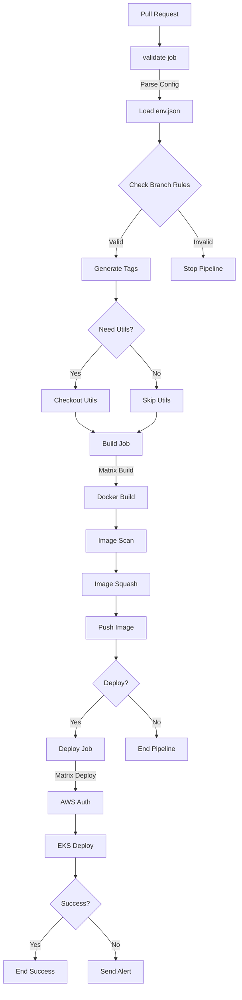

# CI/CD Pipeline Documentation

## Overview
An automated pipeline for building and deploying applications with matrix build support, security scanning, and Kubernetes deployment capabilities.

## Structure
```
.
├── .github/
│   ├── workflows/
│   │   └── workflow.yml      # Main workflow
│   ├── scripts/
│   │   └── setup_env.sh      # Validation script
│   └── config/
│       └── env.json          # Environment configuration
```

## CI/CD Process

### 1. Validate Job
- Verifies branch rules and environments
- Determines build matrix
- Generates Docker image tags
- Checks utils requirements

### 2. Build Job
Matrix build for each context:
- Docker image build
- Security vulnerability scan
- Image squashing
- Registry publication

### 3. Deploy Job
Matrix deployment per environment:
- AWS authentication
- EKS cluster deployment
- Deployment status verification

## Branch Rules
- `feature/*`, `fix/*` → `development`
- `development` → `staging`
- `staging` → `main`
- Special rules for `affiliates`

## Configuration
env.json defines:
- Branch rules
- Build matrices
- Environments and clusters
- Utils integration

## Docker Tags
- `latest`: main branch
- `staging`: staging branch
- `develop`: development branch
- `feature-*`: feature branches

## Security
- Image scanning
- Secure credential storage
- Vulnerability checks
- Action logging

## Monitoring
- Deployment status
- Telegram alerts
- Build artifacts

Logic schema

